<!--
  Ready to publish — all links are wired.
-->

### Hi, I'm Kalyan (Dev)👋

I'm a Cybersecurity grad student at **Northeastern University** (MS, '27), based in Boston.
I build security tools, break things on purpose, and spend a lot of time on how real systems actually fail.

- 🔭 Currently working on bug bounty tooling, honeypots, secure embedded systems, and personal productivity software
- 🌱 Learning kernel internals, firmware security, and offensive-sec certification material
- 🛠️ Interests: AppSec · API security · vuln research · secure code review · embedded security
- 📫 Reach me: [LinkedIn](https://www.linkedin.com/in/gk-eh/) · [Portfolio](https://kalyangopalam.com/) · kalyan.dev.me@gmail.com

---

### 🔧 Projects I actively work on

- **[Numa](https://github.com/Kalyan-Deva/Numa)** — native Android adaptive-schedule and accountability app (Kotlin, Jetpack Compose, Room, home-screen widget).
- **[Lexicon](https://github.com/Kalyan-Deva/Lexicon)**`Private Repo, Still in Development` — knowledge platform with web, application, and terminal clients for structured technical notes.
- **[Bounty-Hawk](https://github.com/Kalyan-Deva/Bounty-Hawk)** — recon and bug bounty workspace for organizing targets, findings, and reports.
- **[BountyDesk](https://github.com/Kalyan-Deva)** — Next.js AppSec workspace with CVSS scoring, vuln intelligence, and report generation.
- **MITRE eCTF 2026 — NeuSense** — secure embedded design: key derivation, AEAD, replay protection, access control on constrained hardware.
- **Redhawk** *(in progress — public soon)* — new security project, details to follow.

---

### 🚀 Live & Shipped

Things I've deployed, published, or released to the public.

| Release | What it is | Where |
|---|---|---|
| **Lexicon (Web)** | Knowledge platform, live production build | [lexxicon.vercel.app](https://lexxicon.vercel.app) |
| **Lexicon TUI** | Terminal client for Lexicon, published release | [GitHub Release](https://github.com/Kalyan-Deva/Lexicon) |
| **Numa** | Native Android app, packaged APK release | [GitHub Release](https://github.com/Kalyan-Deva/Numa) |
| **Bounty-Hawk** | Recon and bug bounty workspace, public repo | [github.com/Kalyan-Deva](https://github.com/Kalyan-Deva/Bounty-Hawk) |
| **Portfolio** | Personal site, live deployment | [kalyangopalam.com](https://kalyangopalam.com) |

More releases and public builds are on the way — check the [pinned repositories](https://github.com/Kalyan-Deva) for the latest.

---

### 🧰 Tech I use

**Languages**  

**Frameworks & Platforms**  

**Security**  

**Data**  

---

### 📊 GitHub Stats

  
  

---

### 📌 Highlights

- MITRE eCTF 2026 — secure embedded system (crypto, access control, protocol hardening)
- Hands-on work with honeypots, IDS/IPS, and network monitoring
- Building open-source tooling for vuln tracking, recon, and finding management
- Focused on responsible disclosure and practical security engineering

---

### 📫 Reach out

If you're working on security tooling, open-source security projects, or AppSec research — happy to talk.

